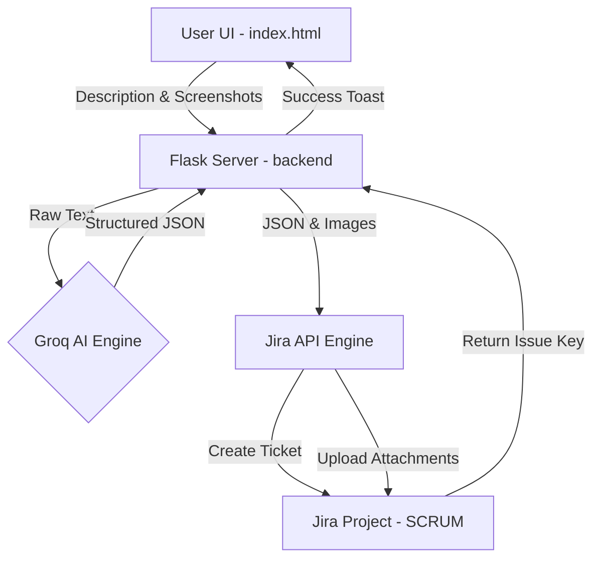

<<<<<<< HEAD
# pd_bug_reported_give_description_upload_screenshot_ai_agent
=======
# 🚀 Jira Ticket Pilot: AI-Powered Bug Reporter

Jira Ticket Pilot is a premium, automated bug reporting agent. It leverages **Groq (gpt-oss-120b)** to transform raw user descriptions and **multiple screenshots** into professional, structured Jira tickets via the Jira REST API v3.

## 🌟 Key Features
- **Premium Glassmorphism UI**: High-end dark mode interface for intuitive bug reporting.
- **AI Brain**: Uses Groq LLM to automatically generate "Steps to Reproduce", "Expected", and "Actual" results.
- **Multi-Evidence Support**: Supports drag-and-drop for multiple screenshots, automatically attached to Jira issues.
- **Professional Formatting**: Tickets are formatted using Atlassian Document Format (ADF) for a perfect look in Jira.
- **Silent Background Agent**: Runs as a hidden Windows background service for zero-interference usage.

---

## 📐 Architecture & Data Flow



---

## 🛠️ Tech Stack
- **Frontend**: Vanilla HTML5, CSS3 (Custom Glassmorphism), Modern JavaScript.
- **Backend Orchestration**: Python 3.10+ (Flask, Requests).
- **LLM Integrated**: Groq API (`openai/gpt-oss-120b`).
- **Target Integration**: Atlassian Jira Cloud REST API v3.

---

## 🚀 Setup & Installation

### 1. Requirements
- Python 3.x
- `pip install flask flask-cors requests python-dotenv`

### 2. Configuration
Create a `.env` file in the root directory:
```env
JIRA_BASE_URL=https://yourdomain.atlassian.net
JIRA_EMAIL=your-email@example.com
JIRA_API_TOKEN=your-token
JIRA_PROJECT_KEY=PROJ

GROQ_API_KEY=your-groq-key
GROQ_MODEL=openai/gpt-oss-120b
```

### 3. Running the App
For an interference-free experience on Windows, use the included background launcher:
- Double-click **`Jira_Ticket_Pilot`** shortcut.
- Access at **[http://localhost:5000](http://localhost:5000)**.

---

## 🏛️ B.L.A.S.T. Protocol
This project was developed using the **B.L.A.S.T.** protocol:
- **Blueprint**: Mapped the data flow from UI to Jira.
- **Link**: Verified API connectivity with Groq and Jira.
- **Architect**: Built the 3-layer system (Architecture, Navigation, Tools).
- **Stylize**: Applied premium aesthetics and ADF ticket formatting.
- **Trigger**: Automated local background deployment.

---

## 🛡️ License
Proprietary. Developed for automated QA workflows.
>>>>>>> ef1041f (Initial commit: Jira Ticket Pilot AI Agent with Premium UI and Groq Integration)
